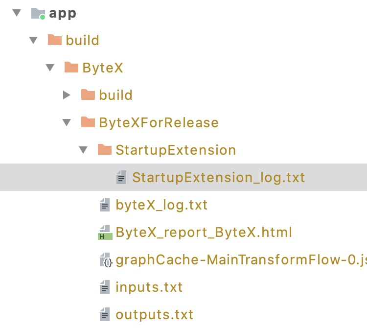
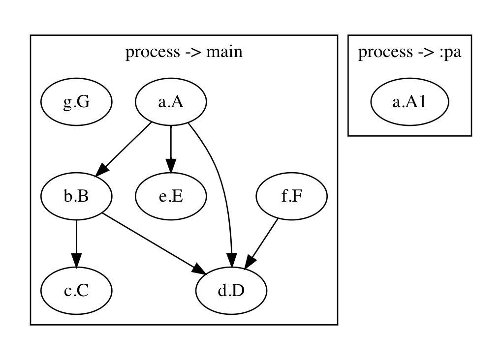

# Startup

Android多模块任务启动方案

本方案旨在解决 **Android模块化** 之后模块之间启动依赖关系，并优化 App 启动速度

## Feature

- 支持模块化（模块各自声明自己的初始化启动任务）
- 支持并发（初始化任务并行执行，加速App启动）
- 支持阻塞启动线程（异步任务也可以阻塞App启动）
- 支持多进程（启动链区分进程）
- 编译期校验任务依赖合法性（即时纠错）
- 编译期生成启动任务执行顺序以及依赖关系
- 已配置混淆
- 同度任务支持优先级配置（1.0.0-beta05+）

## 使用

```groovy
// in root/build.gradle
buildscript {
    ext {
        startup_version = latest_version
    }
    repositories {
        jcenter()
    }
    dependencies {
        classpath "maven.evilmouth.startup:core-plugin:$startup_version"
    }
}

allprojects {
    repositories {
        jcenter()
    }
}

// in each module/build.gradle
dependencies {
    implementation "maven.evilmouth.startup:core:$startup_version"
}

// in app/build.gradle
apply plugin: 'bytex'
apply plugin: 'com.zyhang.startup'
```

- 实现一个 StartupTask
- 使用 StartupTaskRegister 注解声明属性

```kotlin
@StartupTaskRegister(id = "a.A")
class A : AndroidStartupTask() {
    override fun startup(context: Context) {
        Log.i("Core", "A startup")
    }
}

@StartupTaskRegister(
    id = "b.B",
    idDependencies = ["a.A"],
    executorFactory = IOExecutor.Factory::class
)
class B : AndroidStartupTask() {
    override fun startup(context: Context) {
        Thread.sleep(3000)
        Log.d("Core", "B startup")
    }
}
```

更多使用详情见 module app

## 说明

### StartupTaskRegister 属性

```kotlin
annotation class StartupTaskRegister(
    /**
     * 任务id，唯一标识
     */
    val id: String,
    /**
     * 该任务所依赖的任务id集合，一个模块可能需要依赖多个模块
     */
    val idDependencies: Array<String> = [],
    /**
     * 任务执行器，默认为BlockExecutor，即直接在当前线程（App启动线程）执行
     * @see BlockExecutor 同步 串行
     * @see IOExecutor 异步 并行
     * @see CPUExecutor 异步 并行
     */
    val executorFactory: KClass<out ExecutorFactory> = BlockExecutor.Factory::class,
    /**
     * 当 executor 不是 BlockExecutor（理解为异步）时，是否需要阻塞当前线程（App启动线程）
     * 当然如果使用 BlockExecutor，该属性不管 true/false 作用都一样
     */
    val blockWhenAsync: Boolean = false,
    /**
     * 进程名，默认空表示在主进程
     * 不允许两个不同进程的任务之间有依赖关系的
     */
    val process: String = "",
    /**
     * 优先级越大，任务越快分发
     * 如果两个同度任务优先级一致，该框架不能保证分发顺序
     */
    val priority: Int = 0,
)
```

### 生成的启动任务执行顺序和依赖关系

> 本插件在 Bytex 基础上开发，生成的日志都在 Bytex 的标准日志输出位置

</img>

```
process->main
任务排序:
g.G -> f.F -> a.A -> h.H -> b.B -> e.E -> i.I -> d.D -> c.C
同步任务分发顺序:
a.A -> h.H -> e.E -> i.I
异步任务分发顺序:
g.G -> f.F -> b.B -> d.D -> c.C
App启动时任务分发顺序:
g.G -> f.F -> b.B -> d.D -> c.C -> a.A -> h.H -> e.E -> i.I
```

</img>

## Thanks

[Bytex](https://github.com/bytedance/ByteX)
[android-startup](https://github.com/idisfkj/android-startup)
